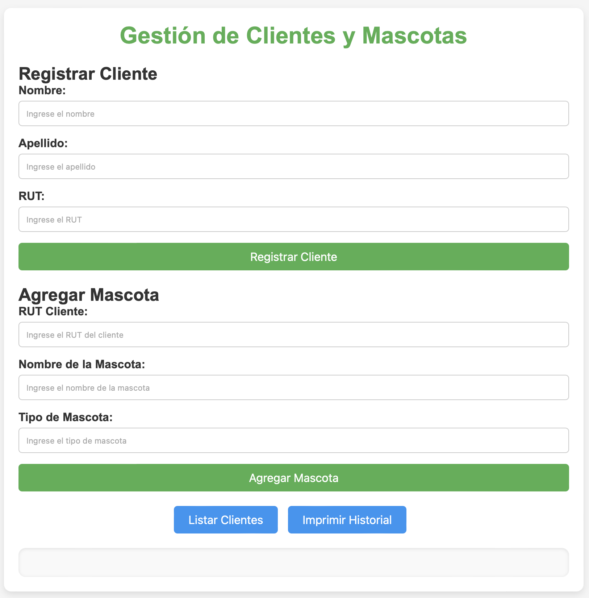

#### Esta es la interfaz estilo aplicación desarrollada en JavaScript, basada en el ejercicio original realizado en Python, que puedes encontrar en el repositorio [**Gestion_de_clientes**](https://github.com/LuisCerelli/Gestion_de_Clientes). 
La página web está disponible y funcionando en el siguiente enlace:  
[https://luiscerelli.github.io/Gestion_de_clientes_JS/](https://luiscerelli.github.io/Gestion_de_clientes_JS/).

